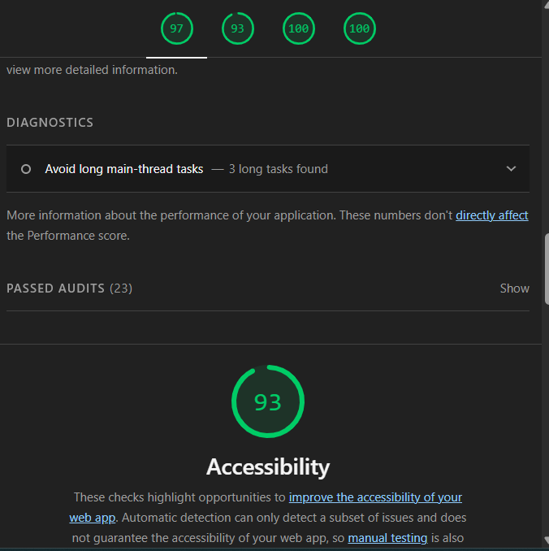
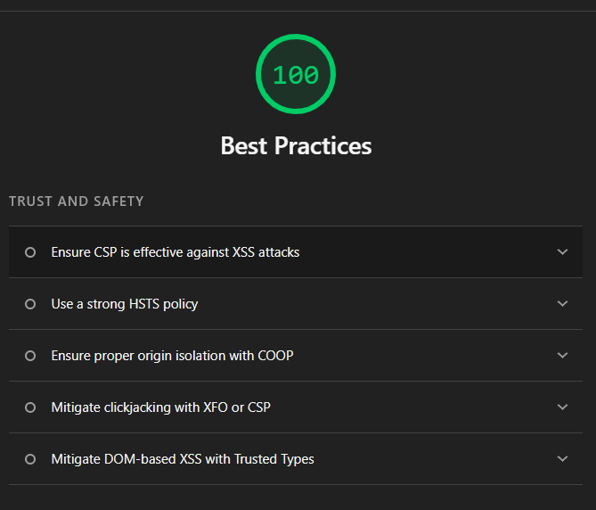
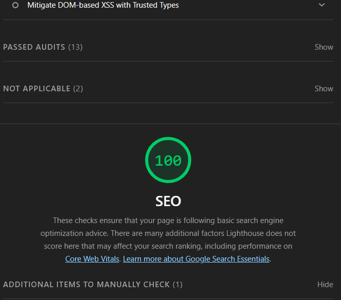
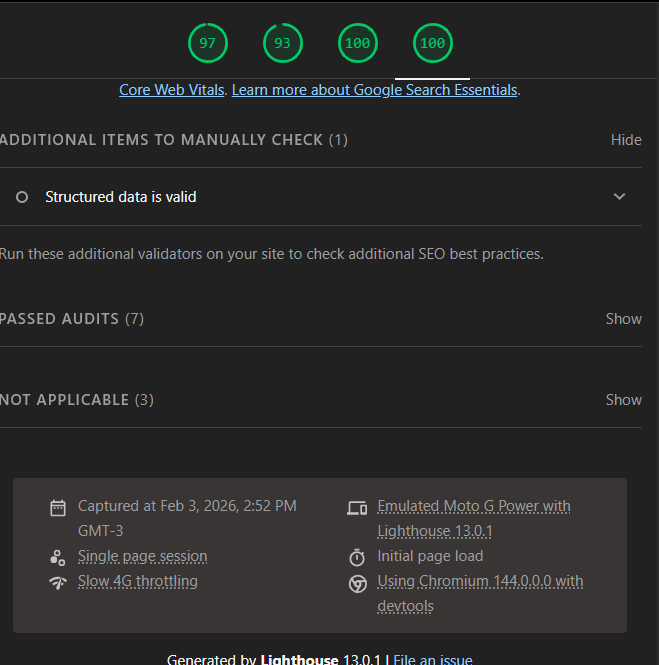

# FIAP – Front-end Engineering  
## Projeto: English Vocab Helper com BFF próprio

---

## 1. Integrantes

- Jefferson Felipe Miranda – RA: 363349  
- Lucas Ventura Melo da Silva – RA: 361038  
- Luís Fernando de Oliveira – RA: 362539  
- Marcelo Pacheco Vieira da Cunha – RA: 360712  

---

## 2. Sobre o Projeto

Este projeto foi desenvolvido para a disciplina de **Front-end Engineering** com o objetivo de construir uma aplicação web que consome um **BFF (Backend for Frontend) próprio**, implementado em Node.js.

A aplicação permite que o usuário:

- Gere palavras em inglês dinamicamente via IA  
- Visualize descrição e casos de uso  
- Escreva frases utilizando essas palavras  
- Receba validação gramatical automática  

O sistema foi estruturado com separação clara entre Front-end e Back-end, seguindo boas práticas de arquitetura.

---

## 3. Arquitetura

O projeto está dividido em duas camadas principais:

- **Frontend** → Aplicação Web (HTML + Tailwind + JS)
- **Backend (BFF)** → API própria em Node.js + Express

### Fluxo da Aplicação

1. O usuário acessa o Front-end
2. O Front realiza requisição para `/ask`
3. O BFF consulta um modelo de IA (Groq API)
4. O BFF retorna um array com:
   - `word`
   - `description`
   - `useCase`
5. O Front renderiza os dados
6. O usuário escreve uma frase
7. A frase é validada via LanguageTool API

---

## 4. Tecnologias Utilizadas

### Front-end
- HTML5  
- TailwindCSS  
- JavaScript (Vanilla)  
- Fetch API  
- LanguageTool API  

### Back-end (BFF)
- Node.js  
- Express  
- Axios  
- Groq API  
- Express-rate-limit  
- CORS  
- New Relic  
- Deploy via Render  

---

## 5. Estrutura do Projeto

```
fiap-bff-projectname/
│
├── backend/
│   ├── routes/
│   ├── app.js
│   └── package.json
│
├── frontend/
│   ├── index.html
│   └── app.js
│
├── docs/
│   └── images/
│       ├── lighthouse-performance.png
│       ├── lighthouse-accessibility.png
│       └── ...
│
└── README.md
```

---

## 6. Deploy

### API (BFF)

Deploy realizado no Render.

**URL da API:**  
https://fiap-bff-v2.onrender.com

**Endpoint principal:**  
https://fiap-bff-v2.onrender.com/ask

---

### Front-end

Deploy realizado como **Static Site no Render**.

**URL do site:**  
https://fiap-front-v2.onrender.com

---

### Como realizar o Deploy no Render

#### Backend (Web Service)

1. New → Web Service
2. Root Directory: `backend`
3. Build Command: `npm install`
4. Start Command: `npm start`
5. Definir variáveis de ambiente (ex: GROQ_API_KEY)

#### Front-end (Static Site)

1. New → Static Site
2. Root Directory: `frontend`
3. Build Command: (vazio)
4. Publish Directory: `.`

---

## 7. Execução Local

### Back-end

```bash
cd backend
npm install
npm start
```

A API ficará disponível em:

http://localhost:3001

> Obs: A porta pode variar caso a variável de ambiente `PORT` seja alterada no arquivo `.env`.

```

---

### Front-end

```bash
cd frontend
npx serve .
```

Ou utilizar Live Server no VS Code.

## Links do Projeto (Produção)

- **Repositório (GitHub):** https://github.com/lucasvms01/fiap-bff-projectname  
- **Site (Front-end em Cloud):** https://fiap-front-v2.onrender.com  
- **API (BFF em Cloud):** https://fiap-bff-v2.onrender.com  
- **Endpoint principal:** https://fiap-bff-v2.onrender.com/ask  


---

## 8. Funcionalidades Implementadas

- Geração dinâmica de palavras via IA  
- Exibição de descrição e casos de uso  
- Campo para escrita de frase  
- Validação gramatical automática  
- Sugestões de melhoria  
- Filtro de palavras  
- Rate limit na API  
- Monitoramento com New Relic  
- Separação clara entre Front-end e BFF  

---

## 9. Segurança e Boas Práticas

- Uso de variáveis de ambiente (.env)
- Arquivo .env não versionado
- node_modules ignorado via .gitignore
- Rate limit implementado
- CORS configurado
- Organização modular do código
- Uso de trust proxy para ambiente cloud

---

## 10. Métricas de Performance (Web Vitals)

A aplicação foi analisada utilizando o **Lighthouse** no ambiente de produção (Render).

### Métricas avaliadas

- **LCP (Largest Contentful Paint):** mede o tempo necessário para o maior elemento visível da página ser carregado.
- **FID (First Input Delay):** mede o tempo de resposta da aplicação à primeira interação do usuário.
- **CLS (Cumulative Layout Shift):** mede a estabilidade visual da interface (evita “saltos” inesperados).
- **Performance Score:** nota geral baseada nas métricas principais.

As métricas obtidas demonstram que a aplicação está dentro dos parâmetros aceitáveis de performance e estabilidade visual.

### Relatórios Lighthouse

#### 1. Performance


#### 2. Accessibility


#### 3. Best Practices


#### 4. SEO


#### 5. Diagnósticos Complementares






---

## 11. Critérios da Tarefa Atendidos

- Repositório público
- Deploy do Front-end em cloud
- Deploy da API própria
- Integração com IA
- Validação gramatical
- README estruturado
- Monitoramento
- Documentação das métricas Web Vitals

---

## 12. Conclusão

O projeto demonstra a implementação completa de uma arquitetura Front-end + BFF com deploy em ambiente cloud, integração com IA, validação gramatical automática e monitoramento da aplicação, atendendo integralmente aos requisitos propostos na disciplina de Front-end Engineering.

---

## Acesso ao site (Cloud)

https://fiap-front-v2.onrender.com
